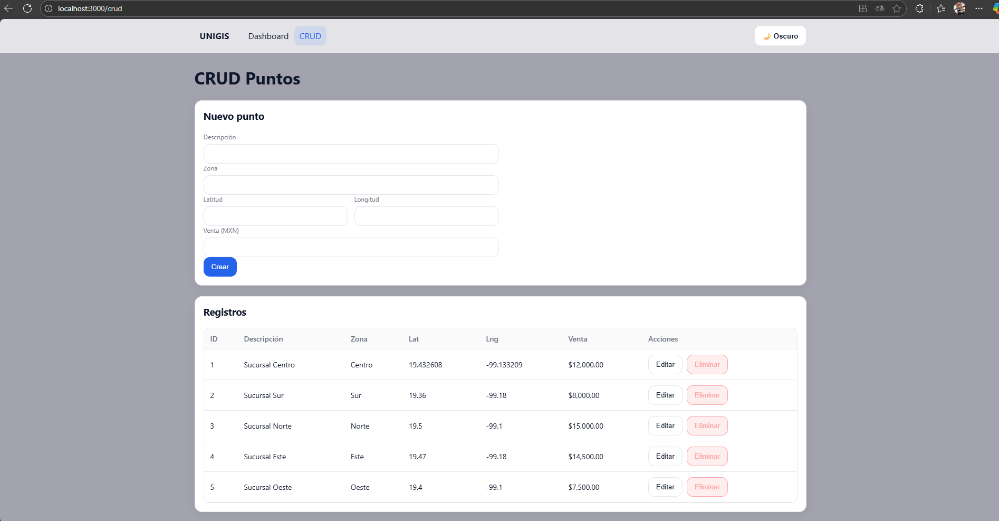
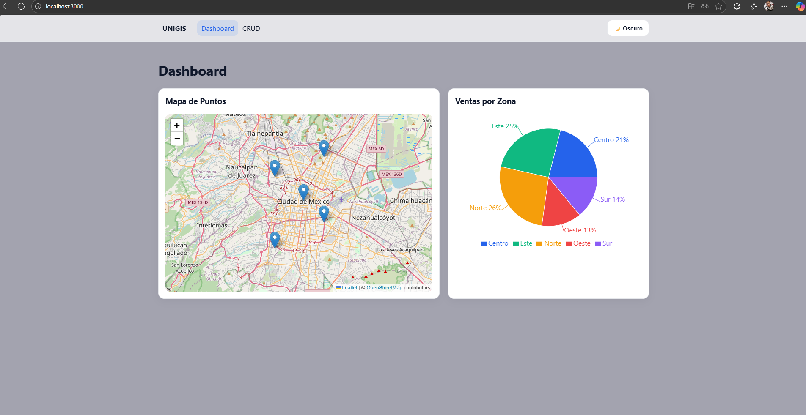
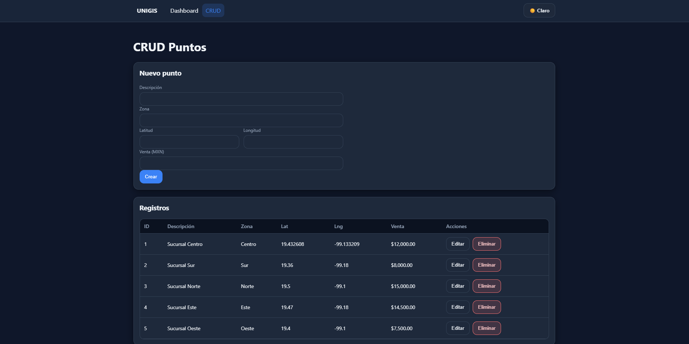
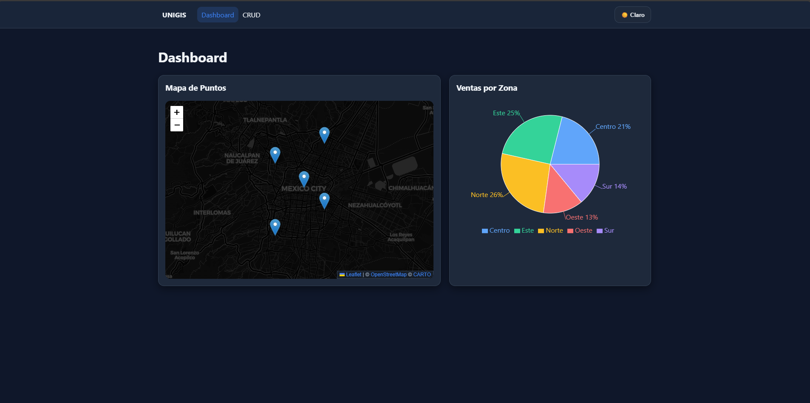

# UNIGIS - Prueba Técnica Full Stack

Este proyecto es una solución **Full Stack** desarrollada como parte de una prueba técnica. Incluye un **backend en .NET 6 (Web API)** y un **frontend en React** con funcionalidades de CRUD, visualización de gráficas y un mapa interactivo.

---

## 🚀 Tecnologías utilizadas

### Backend (.NET 8 - Web API)

* ASP.NET Core Web API
* Entity Framework Core (Code First, Migrations)
* SQL Server
* Swagger para documentación de la API

### Frontend (React)

* React 19
* React Router DOM
* Axios (consumo de API REST)
* Recharts (gráficas interactivas)
* React-Leaflet + Leaflet (mapa interactivo)
* CSS con soporte para **modo claro y oscuro**

---

## ⚙️ Funcionalidades principales

* **CRUD completo**: gestión de entidades (ej. zonas, ventas).
* **Visualización de datos**: gráficas dinámicas con `recharts`.
* **Mapa interactivo**: uso de `react-leaflet` para mostrar zonas.
* **Modo claro/oscuro**: conmutador de temas para mejorar la experiencia de usuario.
* **Interfaz responsiva**: diseño adaptado para escritorio y dispositivos móviles.

---

## 📂 Estructura del proyecto

```
/Unigis-Prueba-Tecnica
│── /unigis-api        → Backend en .NET (Web API + EF Core)
│── /unigis-client     → Frontend en React
│   │── /src
│   │   ├── /components  → Componentes (CRUD, gráficas, mapa...)
│   │   ├── /api         → Configuración de Axios
│   │   ├── App.js       → Archivo principal
│   │   ├── index.js     → Punto de entrada
│   │   ├── index.css    → Estilos globales (claro/oscuro)
```

---

## 🛠️ Configuración y ejecución

### 1. Clonar el repositorio

```bash
git clone https://github.com/usuario/Unigis-Prueba-Tecnica.git
cd Unigis-Prueba-Tecnica
```

### 2. Backend (.NET API)

```bash
cd unigis-api
dotnet restore
dotnet ef database update
dotnet run
```

La API se ejecutará en:
👉 `https://localhost:5001/swagger`

### 3. Frontend (React)

```bash
cd unigis-client
npm install
npm start
```

La aplicación se ejecutará en:
👉 `http://localhost:3000`

---

## 🎨 Vista previa

### 🌞 Modo Claro




### 🌙 Modo Oscuro




---

## ✅ Evaluación de la prueba

Este proyecto cumple con los criterios solicitados:

* Desarrollo de una **API REST** en .NET Core.
* Consumo de la API desde un **frontend en React**.
* **CRUD completo** de entidades.
* Visualización de información con **gráficas** y **mapa interactivo**.
* Diseño **responsivo** y con soporte de **modo claro/oscuro**.

---

## 📌 Notas

* Para conectarse a la base de datos, editar la cadena de conexión en `appsettings.json`.
* El frontend asume que la API corre en `https://localhost:5001`. Si se cambia el puerto, actualizar `src/api/http.js`.
